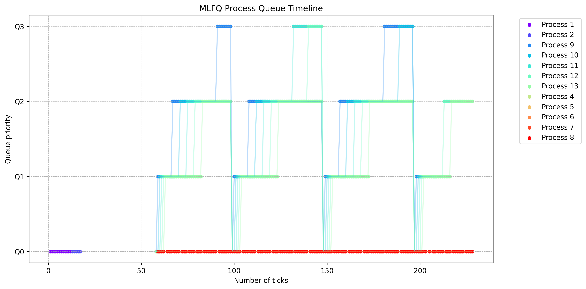

# Report on scheduling

On running schedulertest:

Default (Round Robin): Average rtime 12, wtime 193

Lottery Based Scheduling (LBS): Average rtime 11, wtime 123 

Multi-Level Feedback Queue (MLFQ): Average rtime 11, wtime 189

The MLFQ scheduler would show the best average runtime (rtime) overall, (although not visible) here likely due to its ability to prioritize shorter, interactive processes. LBS significantly reduces average waiting time (wtime) compared to the default, possibly due to better load balancing. MLFQ also improves wtime over the default, striking a balance between runtime and waiting time improvements.

## Implications of adding arrival time in lottery-based scheduling:
Adding arrival time to lottery-based scheduling can help mitigate the "late-arrival problem" where newly arrived processes might wait excessively long before being scheduled. It gives preference to processes that have been waiting longer. However, this approach may lead to unfairness if not carefully balanced with the ticket allocation. For example, a process with few tickets but early arrival might consistently preempt a later-arriving process with many tickets.
A potential pitfall is that the system could become less responsive to changes in process priorities if arrival time dominates the scheduling decision. If all processes have the same number of tickets, the scheduler would essentially become a First-Come-First-Served (FCFS) scheduler, which can lead to poor performance for short processes arriving after long-running ones.

Graph for MLFQ analysis:

